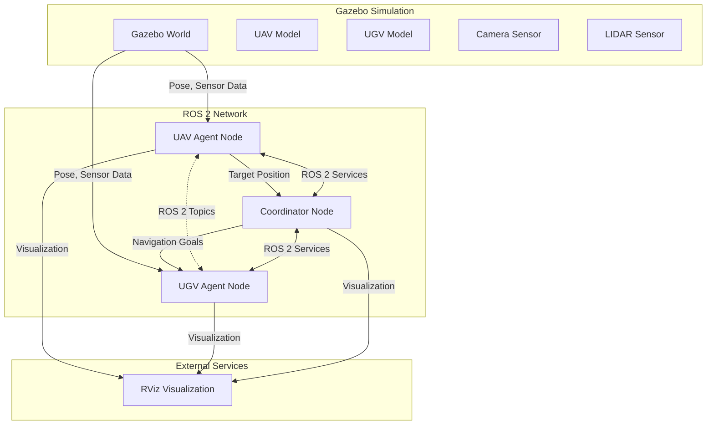

# System Architecture

## Component Descriptions

### 1. UAV Agent
- **Role**: Aerial exploration and target detection
- **Sensors**: 
  - Camera for visual detection
  - IMU for orientation
  - GPS (simulated)
- **Behaviors**: 
  - Autonomous exploration
  - Target detection and tracking
  - Communication with UGV

### 2. UGV Agent
- **Role**: Ground navigation and object interaction
- **Sensors**:
  - LIDAR for obstacle detection
  - Wheel encoders for odometry
- **Behaviors**:
  - Path following
  - Obstacle avoidance
  - Target approach

### 3. Coordinator
- **Role**: System orchestration
- **Functions**:
  - Task allocation
  - Communication management
  - System monitoring
  - Failure recovery

### 4. Simulation Environment
- **Gazebo World**:
  - Obstacles
  - Targets
  - Communication constraints
  - GPS-denied zones

## Communication Architecture

### Topics
- `/uav1/odom` - UAV odometry
- `/ugv1/odom` - UGV odometry
- `/uav1/camera/image_raw` - Camera feed
- `/uav1/scan` - UAV LIDAR data
- `/ugv1/scan` - UGV LIDAR data
- `/uav/target_position` - Detected target positions
- `/ugv1/goal_pose` - Navigation goals for UGV

### Services
- `/uav1/set_mode` - Change UAV operation mode
- `/ugv1/set_mode` - Change UGV operation mode
- `/coordinator/request_help` - Request assistance from other agents

## Data Flow
1. UAV captures images and processes them for target detection
2. When a target is found, its position is published to `/uav/target_position`
3. Coordinator receives target position and assigns the UGV to investigate
4. UGV plans a path to the target while avoiding obstacles
5. Upon reaching the target, UGV performs the required task
6. System continues exploration

## Failure Modes and Recovery

### Communication Loss
- Agents switch to pre-planned fallback behaviors
- Store important data for later transmission
- Attempt to re-establish connection

### Sensor Failure
- Use sensor fusion to compensate
- Switch to alternative sensors if available
- Notify operator if critical failure

### Navigation Failure
- Attempt recovery behaviors
- Request assistance from other agents
- Return to last known good position

## Performance Metrics
- Target detection accuracy
- Time to complete mission
- Communication bandwidth usage
- Power consumption (simulated)
- Collision avoidance success rate
